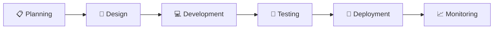

<div align="center">


# 🚀 ON-SITE PROJECT


<br>


</div>

---

<div align="center">

## 🎥 PROJECT SHOWCASE

<a href="https://github.com/">
    
</a>

</div>

---

<div align="center">

## 🌐 LIVE PREVIEW


</div>

---

## ✨ PROJECT OVERVIEW

<div align="center">


</div>

---

## 🎬 DEMONSTRATION VIDEO

<div align="center">

<a href="https://www.youtube.com/watch?v=YOUR_VIDEO_ID">
    
</a>

### ▶ Click Thumbnail To Watch Full Demo

</div>

---

## 🏗 DEVELOPMENT FLOW



---

<div align="center">

## 📸 PROJECT GALLERY


<br><br>


</div>

---

<div align="center">

## 🎞 UI ANIMATIONS


</div>

---

<div align="center">

## 👨‍💻 DEVELOPMENT TEAM

| Member             | Role            |
| ------------------ | --------------- |
| 👨‍💻 Garry        | Project Lead    |
| 🎨 UI Designer     | Frontend Design |
| ⚙ Backend Engineer | APIs & Services |
| ☁ DevOps Engineer  | Deployment      |
| 🧪 QA Engineer     | Testing         |

</div>

---

<div align="center">

## 🛠 TECHNOLOGY STACK


</div>

---

<div align="center">

## 📊 PROJECT PROGRESS


</div>

---

<div align="center">

## 🚀 DEPLOYMENT PIPELINE

```text
Code
 │
 ▼
Build
 │
 ▼
Test
 │
 ▼
Deploy
 │
 ▼
Production
```

</div>

---

<div align="center">

## 🌟 PROJECT HIGHLIGHTS

✨ Responsive Design

⚡ High Performance

🔒 Secure Architecture

📱 Mobile Friendly

☁ Cloud Ready

🎨 Modern UI/UX

</div>

---

<div align="center">

## 🎥 FINAL WALKTHROUGH

<a href="https://www.youtube.com/watch?v=YOUR_VIDEO_ID">

</a>

</div>

---

<div align="center">


### 🚀 Developed by Garry's Developers Team

</div>
